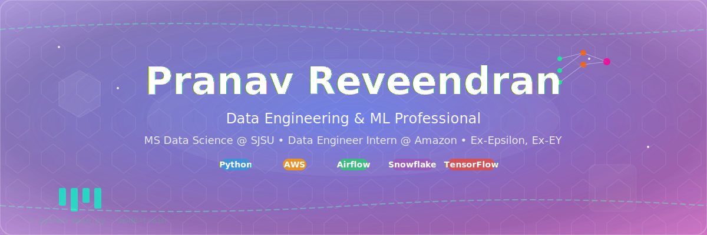

  

<h1 align="center">Hi there, I'm Pranav 👋</h1>

  <em>Data Engineering & ML Professional | Storyteller with Data</em>

  
  
  
  

  
  
  
  
  

---

## 🚀 About Me

I'm a Data Engineering & ML Professional with 3.5+ years of experience bridging the gap between robust data infrastructure and actionable insights. Currently pursuing MS in Data Science at San Jose State University while seeking 2025 full-time opportunities.

I specialize in designing end-to-end data solutions that drive business impact. Incoming Intern @ Amazon | Ex-Data Engineer at Epsilon | Ex-EY.

---

## 🏆 Achievements

- 🥇 Built enterprise-grade data pipelines processing 2TB+ daily data with 99.8% reliability
- 🚀 Reduced model training time by 42% using feature stores
- 🏅 Speaker at data engineering and ML events
- 📈 Optimized Snowflake data models for 45% faster queries and 28% lower storage costs

---

## 🛠️ Technical Stack

  
  
  
  
  

  
  
  
  
  

  
  
  
  
  

### 📊 Detailed Technical Expertise

<b>🔧 Data Engineering</b>

- **Languages**: Python, SQL, Scala, Java
- **Frameworks**: Apache Airflow, dbt, Apache Spark, Apache Kafka
- **Databases**: Snowflake, PostgreSQL, MongoDB, Redis, DynamoDB
- **Cloud Platforms**: AWS (S3, Redshift, Glue, EMR), GCP (BigQuery, Dataflow), Azure
- **ETL/ELT**: Custom pipelines, real-time streaming, batch processing

<b>🤖 Machine Learning & AI</b>

- **ML Libraries**: TensorFlow, PyTorch, Scikit-learn, XGBoost, LightGBM
- **Data Science**: Pandas, NumPy, Matplotlib, Seaborn, Plotly
- **MLOps**: Kubeflow, MLflow, Model monitoring, A/B testing
- **Time Series**: Prophet, ARIMA, Seasonal decomposition
- **NLP**: BERT, GPT integration, Text preprocessing

<b>☁️ Cloud & DevOps</b>

- **Containerization**: Docker, Kubernetes, Container orchestration
- **CI/CD**: GitHub Actions, Jenkins, GitLab CI
- **Infrastructure**: Terraform, CloudFormation, Infrastructure as Code
- **Monitoring**: Prometheus, Grafana, CloudWatch, DataDog
- **Version Control**: Git, GitHub, GitLab

---

## 🎯 Goals

- Advance MLOps by developing scalable solutions bridging data engineering and ML deployment
- Build open-source tools to streamline data workflows
- Share knowledge through technical writing and code contributions

---

## 📝 Latest Medium Blog Posts

<!-- BLOG-POST-LIST:START -->
<!-- BLOG-POST-LIST:END -->

  <a href="https://medium.com/@pranav.reveendran">Read more on Medium</a>

---

## 🏆 GitHub Trophies

  

## 📈 GitHub Stats

  
  

  

  

## 🐍 Contribution Snake Game

  

---

## 🌱 Fun Facts

- 🎸 I play guitar in my free time
- 🌍 Love hiking and exploring new places
- 🧩 Enjoy solving logic puzzles and brain teasers

---

## 📫 How to Reach Me

- <b>LinkedIn:</b> [pranav-reveendran](https://linkedin.com/in/pranav-reveendran)
- <b>Medium:</b> [@pranav.reveendran](https://medium.com/@pranav.reveendran)
- <b>Location:</b> San Jose, California, United States

---

  <em>I'm dedicated to translating complex data into strategic business intelligence and developing elegant solutions to challenging data problems.</em>

  <b>#DataScience #DataEngineering #MLOps #MachineLearning #AI #Python #AWS #Spark #Kafka #Airflow #OpenToWork</b>

